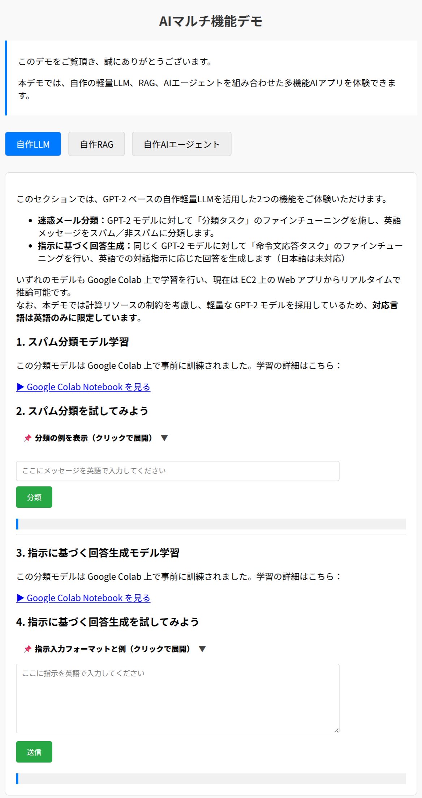
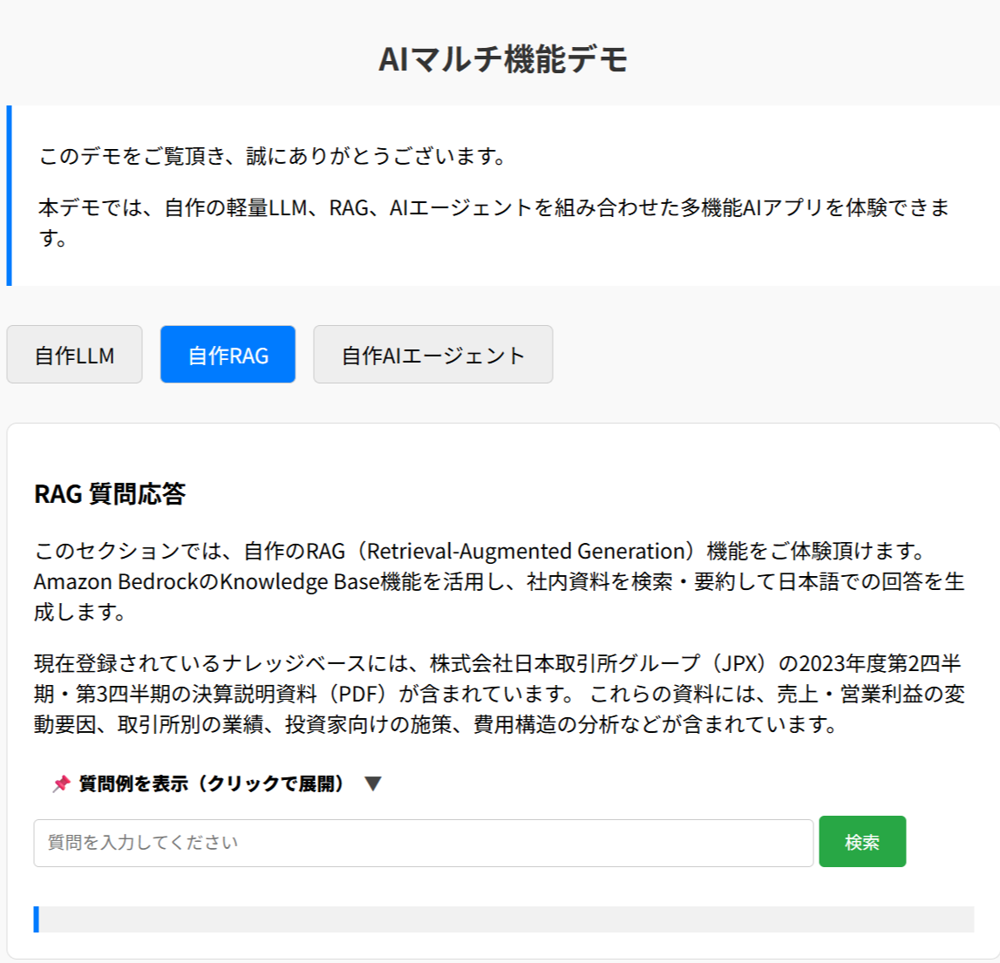
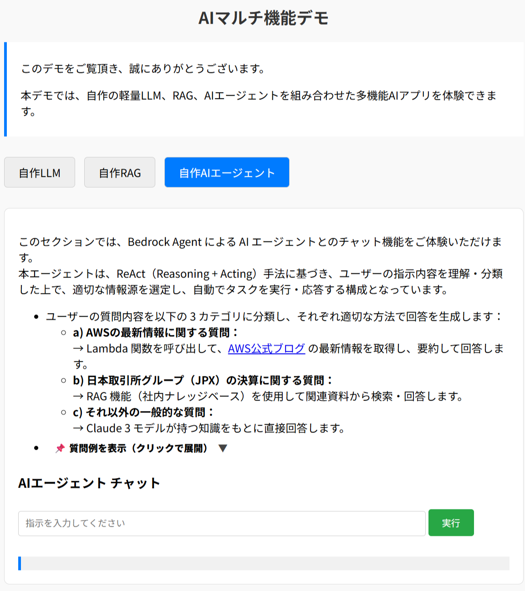

# 🧠 AIマルチ機能デモ

このプロジェクトは、**自作の軽量LLM・RAG・AIエージェント**を統合した多機能AIデモWebアプリケーションです。  
以下の3つのセクションで、AIの異なる活用方法を体験できます：

- ✅ GPT-2ベースの英語テキスト分類と生成（自作LLM）
- 📚 Bedrock + Knowledge Baseによる社内文書検索応答（自作RAG）
- 🧑‍💼 Bedrock Agent によるAIエージェントチャット（自作AIエージェント）

▶️ デモサイト： [https://wonderlusia.site](https://wonderlusia.site)

---

## 🔍 機能一覧

### 🟦 自作LLM（英語対応）
- **迷惑メール分類**：GPT-2に英語スパム分類のファインチューニングを実施。任意の英語メッセージを分類可能。
- **命令応答生成**：命令タスク（Instruction Tuning）で学習済みモデルにより、指定フォーマットの英語指示に応答を生成。

※ モデル学習は Google Colab 上で実施し、現在は EC2 上の Web アプリからリアルタイムで推論を行っています。

---

### 🟩 自作RAG（日本語対応）
- Amazon Bedrock の Knowledge Base 機能を活用。
- JPXの決算説明資料を対象としたナレッジベースを構築。
- 自然な日本語による文書検索・要約応答を提供します。

---

### 🟥 自作AIエージェント（日本語対応）
- Bedrock Agent ＋ ReAct（Reasoning + Acting）手法によるマルチエージェントチャット。
- ユーザーの質問内容に応じて以下の3つの処理を自動で切り替え：
    1. **AWSの最新情報取得**（Lambda + SerpAPI）
    2. **JPX関連の文書検索**（Bedrock RAG）
    3. **その他の質問対応**（Claude 3）

---

## 🛠 技術スタック

### 💻 使用言語・ライブラリ
- Python
    - FastAPI
    - PyTorch
    - tiktoken
    - langchain

### ☁️ 使用サービス・外部API
- **AWS**
    - EC2（Webアプリホスティング）
    - S3（ファイル保存）
    - Bedrock（Claude 3, Knowledge Base, Agent）
    - Lambda（API連携）
- **その他**
    - Claude 3（via Bedrock）
    - Pinecone（ベクトルDB）
    - SerpAPI（Google検索結果取得）
    - Google Colab（モデル訓練環境）

---

## 🚀 実行方法

以下のコマンドでアプリを起動できます：

```bash
uvicorn api_server:app --host 0.0.0.0 --port 5000
```

アプリURL：
- http://localhost:5000
- または [https://wonderlusia.site](https://wonderlusia.site) （公開用）

---

## 🖼️ 画面イメージ

### ▶️ 自作LLM（スパム分類 & 応答生成）


---

### ▶️ 自作RAG（社内資料からの日本語質問応答）


---

### ▶️ 自作AIエージェント（チャット式応答）


---

## 📄 ライセンス

このプロジェクトは教育・技術デモの目的で公開されています。商用利用はご遠慮ください。

---

## 🙋‍♂️ 開発者情報

**崔 玉澤（Yuze Cui）**

- ITエンジニア・プロジェクトマネージャー
- AI実装者検定B級・G検定・Python3データ分析認定取得
- LLMおよびAWS Bedrockを活用した生成AIソリューション開発に取り組んでいます

ご質問・ご連絡は GitHub 上のIssueよりお気軽にどうぞ。
